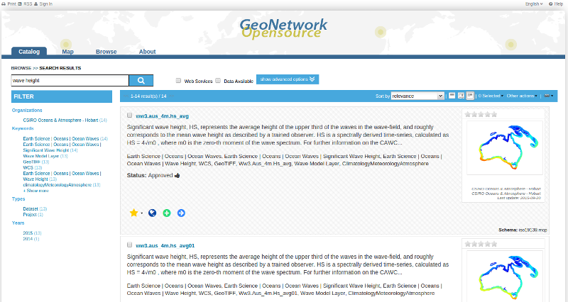

:Author: Simon Pigot
:Version: anzmest-2.10.x
:Reviewer: None
:License: Creative Commons Attribution-ShareAlike 3.0 Unported  (CC BY-SA 3.0)
:Thanks: GeoNetwork Community 

.. |GN| replace:: GeoNetwork

********************************************************************************
Wave Atlas Quickstart 
********************************************************************************

The Australian Wave Atlas metadata is held in a |GN| catalogue. |GN| opensource is a standards based, data management system. It is designed to enable access to data through a set of standard fields that describe the data (metadata).

This Quick Start describes:

- some of the different ways you can search for data
- how to display and download data from the search results

Searching
--------------------------------------------------------------------------------

There are many different ways to search the catalogue. 

To access Search functions, click on the *Catalogue* tab.

Free Text Search
--------------------------------------------------------------------------------

Free text search allows you to search text extracted from all fields in the metadata record and indexed in the GeoNetwork index.

*Type* a search term in the search box next to the magnifying glass/search icon. You can type anything here (free text). You can use quotes around text to find exact combinations of words. When you type 3 or more characters GeoNetwork will search the index and offer you alternatives from the metadata record text to complete your search.

  *The Search Box and some alternatives from the index*

Pressing the search button (magnifying glass/search icon) will do the search and find those records that contain the entered text. 

  *Search results*

Notice that there are also two checkbox filters that you can apply to the results of any search:

*Web Services*: Ticking this checkbox will filter the results and return only those results that have a link to an OGC Web Map Service (WMS)

*Data Available*: Ticking this checkbox will filter the results and return only those results that have a direct link to the data described by the metadata record. At present, only the wave model metadata records have such a link.
  
Search Results
--------------------------------------------------------------------------------

The output of a search provides you a list of the metadata records that should fit your request. For each record, a summary is presented showing the title, abstract, keywords, thumbnail (if any) and date when the metadata was last updated.

    *Search results: a summary of each record is presented*

The list of icons beneath the summary for each record indicates the links that the record has available to online resources, permanent etc. The icons that appear here will depend upon the privileges that the current user has been assigned. Hovering over the icon will present a tooltip that describes what clicking on the icon will do.

*Yellow star:* This is a link to the metadata record that can be copied into your browser bookmarks.

*Globe:* If the record has a link to an OGC Web Map Service (WMS), then clicking on this icon will generate a kml file that can be opened in google earth if you have google earth available on your computer.

*Green plus sign:*  If the record has a link to an OGC Web Map Service (WMS), then clicking on this icon will add the WMS link as a layer to the GeoNetwork web map viewer and open the *Map* tab with the layer displayed on a bright earth background.

    
        *Clicking on a link to a WMS*

*Blue right arrow:* This is a link to a web resource that has been provided in the metadata record. The resource could be a downloadable file or another html page or any type of html link. Hovering over the icon will show the URL of the resource. The example shown in the figure is the link to the wave model data in a record describing a wave model data layer.

    
        *Hovering over a link to a web resource in a wave model data record*

Refining your search: the Filter section
--------------------------------------------------------------------------------

As discussed above, the output of a search provides you with a list of the metadata records that should fit your request. Additional information such as keywords and organizations from the search results is summarized in the *Filter* sidebar. This information (known as facets) can be used indivdiually or in sequence to refine the search results and produce a smaller, more useful set of results. 

    
        *The Filter sidebar for the search results*

An example of how to use this feature for the wave atlas is to select the 'Multile Use Layers' facet from the 'Keywords' section of the Filter sidebar. 

    
        *Choosing 'Multiple Use Layers' in the Filter sidebar*

This will restrict the search to those records that describe Multiple Use layers in the Wave Atlas (145 records):

        *Search refined to 'Multiple Use Layers' only*

Selecting another facet from the Filter sidebar will further restrict the search results. For example, selecting 'Geoscience Australia' from the 'Organizations' section of the Filter sidebar will restrict the search to just those multiple use layers that are provided by Geoscience Australia (11 of the 145 Multiple Use Layers).

    
        *Search refined again to organization 'Geoscience Australia'*

Each time you click on a facet it is added to the list under the free text search box. Facets can be removed or changed by clicking on the facet term itself.

    
       	*Manipulating facets*

Advanced Search
--------------------------------------------------------------------------------

Advanced search allows you to search on text from specific fields in the metadata record (eg. title, keywords, temporal and spatial extent) or administrative data about the metadata records such as categories. Advanced search is activated by clicking on the *show advanced options* button just next to the magnifying glass/search icon:

  *show advanced options button*

The advanced search options are divided into three columns: *What, Where, When*

  *Advanced search options*

In the **What** section the elements are all related to the contents of the metadata record. The fields are populated from the index so that you can restrict your search to content that is actually in the index.  

- To search on any of the **What** fields start typing text into the field or choose the drop down arrow at the right and choose one of the choices in the list populated from the index. If you do not want to search by a given field, simply leave it blank;

  *Typing b into the Keyword field, limits choices to metadata keywords beginning with b*

  *Choosing the drop down arrow to show organisation choices from metadata records*

  *Choosing the drop down arrow to show categories of metadata records*

The **Where** fields, allow you to draw a box and search for metadata records whose extents overlap this box. 

- To draw a box, use the tool at the top right of the map;

  *To draw a search box*

  *Drawing a search box to apply in an advanced search*

The **When** fields, allow you to select metadata records based on:

- the date when they were last modified (*Change date*)
- their temporal extent
- creation, modification, publication date

To activate any of these search fields, simply select a *From:* and *To:* date using the date widgets provided at the right hand side of the fields:

  *Searching on Change date in an advanced search*

The examples above have shown how to specify individual advanced search fields. Obviously these fields can be combined with each other and with the free text search fields to limit the search results as required. To search on any combination of free text and/or advanced search fields click the magnifying glass/search icon next to the free text search field.

  *Searching on advanced and free text search fields*

More information
--------------------------------------------------------------------------------

Read the (somewhat dated) GeoNetwork users manual on http://geonetwork-opensource.org/manuals/2.10.4/eng/users/index.html

